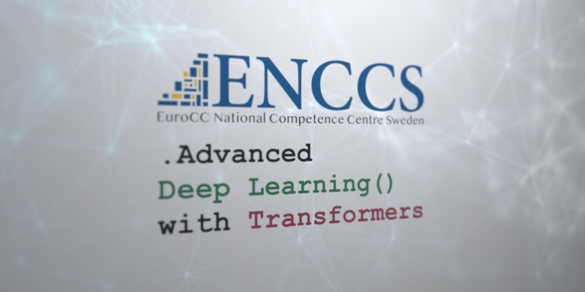

<p align="center">
  
</p>

## Table of Contents
1. [Description](#description)
2. [Information](#information)
3. [File descriptions](#files)
4. [Installing the dependencies](#dependencies)
5. [Certificate](#certificate)

<a name="descripton"></a>
## Description

In recent years, Graph Neural Networks (GNNs) and Transformers have led to numerous breakthrough achievements in a variety of fields such as Natural Language Processing (NLP), chemistry, and physics. By doing away with the need for fixed-size inputs, these architectures significantly extend the scope of problems to which deep learning can be applied.

This workshop will take you from the representation of graphs and finite sets as inputs for neural networks to the implementation of full GNNs for a variety of tasks. You will learn about the central concepts used in GNNs in a hands-on setting using Jupyter Notebooks and a series of coding exercises. While the workshop will use problems from the field of chemistry as an example for applications, the skills you learn can be transferred to any domain where finite set or graph-based representations of data are appropriate. From GNNs, we will make the leap to Transformer architectures, and explain the conceptual ties between the two.

<a name="information"></a>
## Information

The overall goals of this course were the following:
> - Workshop on graphs and how to represent them for neural networks;
> - Short recap of the morning concepts and an introduction to application in chemistry;
> - Working with molecules as graphs and deep dive into using Graph Neural Networks;
> - Implementing a GNN;
> - Overview of Transformers;
> - Implementing a Transformer from a GNN.

More detailed information and links for the course can be found on the [course website](https://hackmd.io/@enccs/transformers-april2023).

<a name="files"></a>
## File descriptions

The training material(slides, recordings, notebooks, etc) can be found on [this website](https://enccs.github.io/gnn_transformers/).

The notebooks and exercises can be found in this repository and are organized in their respective folders, one for each session of the workshop.
This repository contains the notebooks for the ENCCS course on Graph Neural Networks and Transformers. There are two version of the notebooks, one intended to be run on Google Colab (under the colab directory) and one intended to be run locally (under the session_1 to session_4 directories).

<a name="dependencies"></a>
## Installing the dependencies

You need an Anaconda (or conda forge) installation before proceding.

If you run the local files, you need to install the dependencies. These are in conda environment files. Depdending on what GPU you have, run the below commands in a shell:

 #### NVIDIA GPU:
```shell
conda env create - f cuda_environment.yml
```
 #### AMD GPU:
```shell
conda env create -f rocm_environment.yml
```

Once the environment has been created, activate it by running

```shell
conda activate gnnt
```
    
And start the jupyter notebook server:

```shell
jupyter notebook
```

<a name="certificate"></a>
## Certificate

The certificate for the course can be found bellow:

["Advanced Deep Learning with Transformers" - EuroCC National Competence Centre Sweden]() (Issued On: April 2023)
